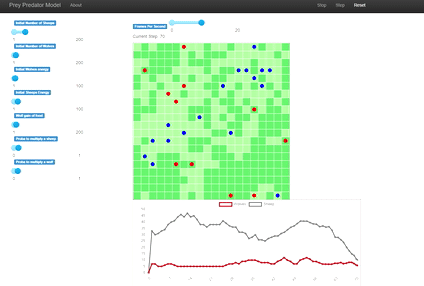
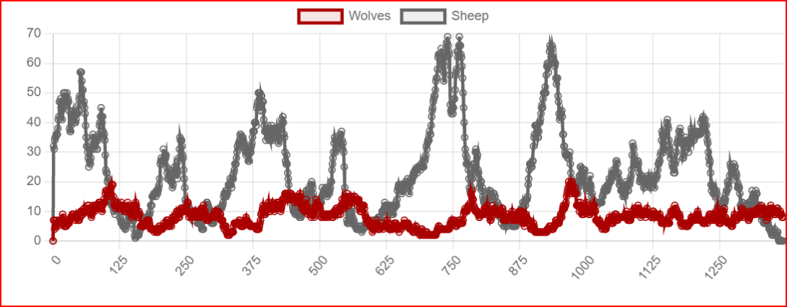

# Prey - Predator Model
_By Timothé Chaumont and Marco Boucas_

You will find here our code for the prey predator model simulation, for the Multi-Agent Models course at [CentraleSupélec](https://www.centralesupelec.fr/).

# How to ?
1. Create a python env
1. Install the requirements `pip install -r requirements.txt`
1. Run the server `make run` or `mesa runserver`

# Approach

In this repository, you will find the code for the MAS TP1, that deals with a simple prey predator model.
Here is the modelisation of this model we decided to implement the following rules:
- The space is represented as a grid 
- 3 kind of agents
    - Grass (green squares)
        - It is present on every square of the grid
        - When eaten, it will take several steps to be fully grown again (and so eatable)
        - It is eaten by the sheeps
    - Sheep (blue points)
        - Some are spawned at the beginning of the simulation
        - They will move randomly
        - They will eat grass
        - They will reproduce alone (hermaphodites)
    - Wolf (red points)
        - Some are spawned at the beginning of the simulation
        - They will move randomly
        - They will eat sheep
        - They will reproduce alone (hermaphodites)

# Code specifications / Rules

Some basic rules we decided to apply in this code (object programming oriented). One of our many concerns was to make sure that the agents do not touch other agents directly, but through the model:
- The agents are only interacting (eating grass or sheeps) through the environment, and do not kill themselves the other agents.
- The reproduction step is done in the model also (easily to do that way also) and the creation also
- Most of the parameters are variables thanks to the sliders, to make it faster to update them and see if it goes OK.
- The agents do not kill themselves when they run out of energy. It is clearly debatable, but it is the system that kill them instead.

# Simulation results
After some tries, we found some parameters that gave good results (meaning, some equilibrium was reached (and not lost too soon)).
Here are the parameters

| Parameter name                   | Value |
|----------------------------------|-------|
| Width                            | 30    |
| Height                           | 30    |
| Initial number of sheeps         | ~40   |
| Initial number of wolves         | 10    |
| Initial wolves energy            | 4     |
| Initial sheeps energy            | 10    |
| Wolf food gain                   | 10    |
| Reproduction probability (sheep) | 0.09  |
| Reproduction probability (wolf)  | 0.09  |

With those parameters, we can reach an equilibrium (that breaks sometimes, too much random)
Some tests were made on a bigger scale, and the results where much more promising if not slower to computer on a long time scale.

We can clearly see the classic evolution:
- When we start, the sheeps are more numerous than the wolves
- When we have a lot of sheeps, the wolves are eating them and reproducing
- When we have a lot of wolves, the sheeps population get smaller, but when not enough sheeps, they slowing starve to death.

## Parameters analysis

We needed to change the parameters quite a lot to find some equilibrium during the simulation (and in fact, we did not reach yet an absolute equilibrium, but instead sometimes all the sheeps or wolves ends up to die.
Here are some observations we made:
- When the size of the space gets bigger (increasing width and height), and if we scale up the starting populations accordingly, the equilibrium is much stable
- We need less wolves than sheeps to reach an equilibrium
- We need to make sure wolves are likely to die fast if not eating, hence decrease the food gain to avoid that wolves stay too much and too long